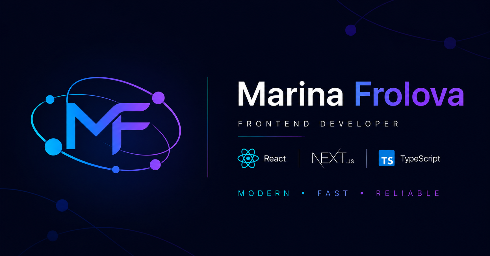

# 🌐 Marina Frolova Portfolio

Modern multilingual portfolio website built with **Next.js 16**, **React 19**, and **TypeScript**.

The project showcases my frontend development experience, commercial work, personal projects, and provides a contact form integrated with modern backend services.

---

# 🌐 Live Demo

<p align="center">
  <a href="https://portfolio-pi-seven-ow7qvbu0qu.vercel.app">
    Open Portfolio
  </a>
</p>

---

# 📸 Preview

<p align="center">
  
</p>

---

# ✨ Features

* 🌍 Multilingual interface (English / Russian)
* 🌙 Dark & Light theme
* 📱 Fully responsive design
* ⚡ Modern animations with Framer Motion
* 🎨 Clean component-based architecture
* 📂 Project showcase with image sliders
* 📧 Contact form with validation
* ☁️ Supabase integration
* ✉️ Email notifications via Resend
* 🌐 SEO optimization
* ♿ Accessible and semantic HTML
* 🚀 Optimized performance

---

# 🛠 Tech Stack

## Frontend

* Next.js 16 (App Router)
* React 19
* TypeScript
* next-intl
* next-themes
* Framer Motion

## Styling

* SCSS
* CSS Modules
* Responsive Design
* CSS Variables

## Forms

* React Hook Form
* Zod

## Backend Services

* Next.js API Routes
* Supabase
* Resend

## Development

* ESLint
* npm

---


## 📂 Project Structure


src/
├── app/
│   ├── layout.tsx
│   ├── robots.ts
│   ├── sitemap.ts
│   ├── api/
│   │   └── contact/
│   │       └── route.ts
│   └── [locale]/
│       ├── layout.tsx
│       ├── page.tsx
│       └── contact/
│           └── page.tsx
│
├── components/
├── lib/
└── messages/

public/

# 🌍 Localization

The application supports:

* 🇬🇧 English
* 🇷🇺 Russian

Localization is implemented with **next-intl**.

---

# 📧 Contact Form

The contact form includes:

* client-side validation with Zod
* React Hook Form
* API Routes
* Supabase database
* email delivery via Resend

---

# 🚀 Getting Started

Clone the repository

```bash
git clone https://github.com/frolovam008-cyber/portfolio.git
```

Install dependencies

```bash
npm install
```

Start development server

```bash
npm run dev
```

Open

```text
http://localhost:3000
```

---

# 📈 Lighthouse 

* ⚡ Performance  97
* ♿ Accessibility   96
* ✅ Best Practices   97
* 🔍 SEO    92

---

# 💡 Highlights

* Next.js App Router architecture
* Component-driven development
* Responsive layouts
* Theme switching
* Internationalization
* Modern animations
* Backend integration
* Clean and scalable codebase

---

# 📄 License

This project is intended for portfolio purposes.
